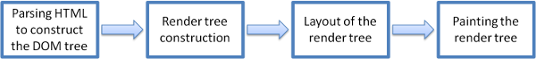
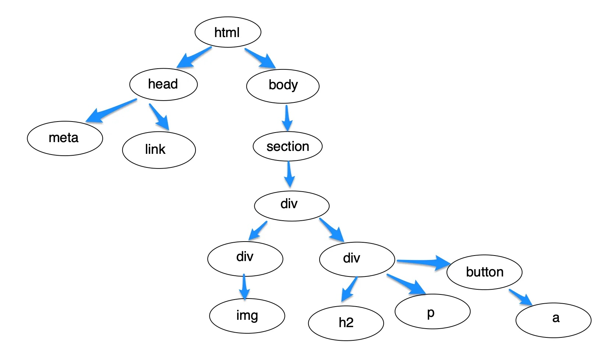

# Rendering Engine Flow

Rendering engines are responsible for displaying requested content on the browser. Different types of rendering engines are available based on the browser. Internet Explorer uses Trident, Firefox uses Gecko, and Safari uses WebKit. Chrome and Opera (from version 15) use Blink, a fork of WebKit.

The rendering engine receives the contents of the requested document from the networking layer in chunks. Most of these chunks are of 8kB in size. The basic flow of the rendering engine is shown below.



<div align="center">
Fig: Basic Flow of Rendering Engine
</div>

Let’s take an example of this design and render it in a browser.


<div align="center">
Fig: 404 page
</div>

The HTML code for the above design is given below.

```html
<!DOCTYPE html>
<html lang="en" >
<head>
  <meta charset="UTF-8">
  <title>CodePen - Yuno 404</title>
  <link rel='stylesheet' href='https://unpkg.com/yuno-design-kit@1.1.11/build/style.1.1.8.css'>
</head>
<body>
<!-- partial:index.partial.html -->
<body class="background background--light background--dark container">
    <section class="page_404 text-center">
        <div class="row col-sm-offset-1 ">
            <div class="four_zero_four_bg">
                
            </div>
            <div class="contant_box_404">
                <h2>
                    Looks like you're lost 😕
                </h2>
                <p>The page you are looking for is not available!</p>
                <button class="button button--tertiary button--small button--solid"> 
                    <a href="/" class="link_404">Go to Home </a>
                </button> 
            </div>
        </div>
    </section>
</body>
ˇˇ
</body>
</html>
```

The rendering of the above-mentioned code in the browser is mentioned below.

**1. Parsing HTML to construct the DOM tree**

The rendering engine parses the chunks of HTML document and converts the elements to **D**ocument **O**bject **M**odel (DOM) nodes in a tree called the “**content tree**” or the “**DOM tree**”. Here, each node represents an HTML tag.

It also parses CSS style present in the webpage and creates a **CSS** **O**bject **M**odel(CSSOM) which is basically a “map” of CSS style rules in tree-like structure.

The DOM tree representation of our HTML is shown below.



<div align="center">
Fig: DOM Tree
</div>

**2. Render tree construction**

The CSSOM and the DOM trees are combined into a render tree. Here, elements of the tree are listed in the order they will be displayed. Starting at the root of the DOM tree, the browser traverses each node. The browser can omit some nodes. For instance: meta tags, script tags, and any nodes are hidden via CSS rules like `display: none`. The elements in the render tree are called “frames” by Firefox. By contrast, WebKit uses the term “render object”.

**3. Layout of a render tree**

When the renderer is created and added to the tree, it does not have a position and size. The process of calculating these values is called layout or reflow. Starting a layout means specifying the exact coordinates of each node so it appears on the screen exactly as designed.

The root renderer is at the position `0,0` and its dimensions are the viewport, which is the visible part of the browser window. Each renderer has a layout or reflow method, and each of those invokes the layout method of its children that require layout.

6\. **Painting the Render Tree**

To display the content on the screen, the renderer tree is traversed and the `paint()`method is called. In order to provide a better user experience, the rendering engine displays content as soon as possible. It will begin building and laying out the render tree before all the HTML has been parsed.

[](codepen://sumn2u/RwoYZGR?height=268&defaultTab=result)

### Let’s summarise <a href="#48aa" id="48aa"></a>

Now let’s put all this information together again and see the steps involved in rendering HTML by browsers.

1. The browser starts off by constructing the DOM by parsing all the relevant HTML.
2. After that, it looks for CSS and JavaScript resources and requests them, which usually happens in the head where we put our external links.
3. The browser then parses the CSS and constructs the CSSOM followed by running the JavaScript.
4. Then the DOM and CSSOM are being merged together into the Render Tree.
5. Lastly, we present the page to the user by running the Layout and Painting step.
